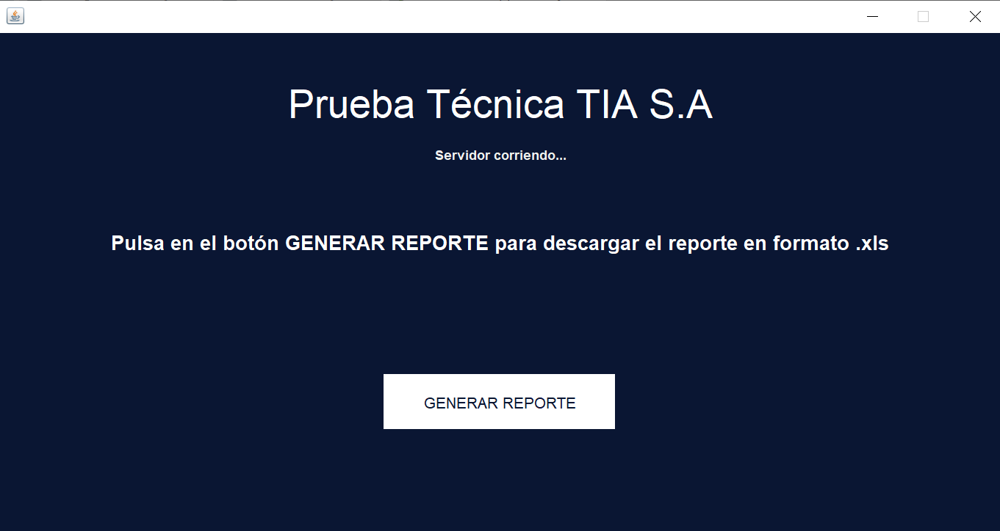

# Prueba tecnica TIA S.A - Ricardo Molina

## Consideraciones principales
1.- Tener libre puerto 8081, puerto por defecto de la aplicacion en Java.

2.- Archivo .env en el directorio script contiene configuraciones globales del script, y archivo application.properties en el directorio resources, la configuracion de la conexion a la BD y la aplicacion en Java.

3.- Proyecto en Java hace uso de Maven y JDK 17.

## Aplicacion en Java
1.- Se hizo uso de SpringBoot y Maven junto con Swing para la GUI.

## Vista previa de la aplicacion
La GUI de la aplicacion en Java se muestra a continuacion:

## Script
1.- En el directorio script se encuentra el archivo .py para realizar las peticiones a la aplicación en Java

2.- Instalar dependencias de requirements.txt para ejecutar el script correctamente

3.- Por defecto buscara el archivo Enemigos.txt en la ruta Downloads o Descargas del Usuario en el que se encuentra la app.

4.- Ejecutar script con python script_peticiones.py, dentro del directorio scripts
